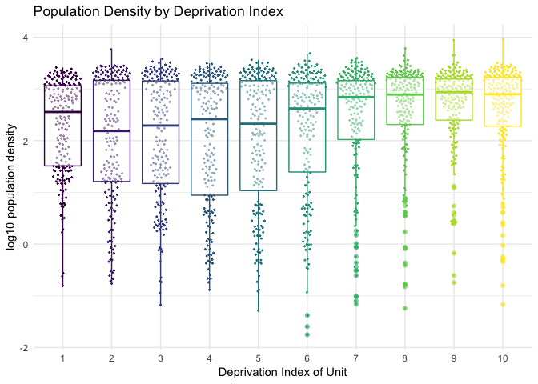

This is not complete - this is a work in progress.

## Data Acknowledgement

In exploring Pokie distribution and deprivation in NZ, I am heavily drawing on Hamish Campbell's (@polemic on Twitter) identification and geocoding of data sources.

https://twitter.com/polemic/status/1105631444519383040

So the data is

* Pokie locations from DIA geocoded by Hamish https://gist.github.com/hamishcampbell/7d7810a9ead83147b39e2bbe969ff188 Crown copyright ©. Gaming machine and gambling expenditure statistics owned and administered by the New Zealand Public Sector by Department of Internal Affairs is licensed under a Creative Commons Attribute 3.0 New Zealand Licence.


* Deprevation Index https://www.otago.ac.nz/wellington/departments/publichealth/research/hirp/otago020194.html downloaded as a file otago069931.txt

* 2013 Stats NZ Area Units https://datafinder.stats.govt.nz/layer/25743-area-unit-2013/ Creative Commons Attribution 3.0 New Zealand. Downloaded as a shape file area-unit-2013.shp

* 2013 Census demographic data from Stats NZ. http://archive.stats.govt.nz/Census/2013-census/data-tables/meshblock-dataset.aspx Source: Stats NZ and licensed by Stats NZ for reuse under the Creative Commons Attribution 4.0 International licence.

And some R libraries I will be using include

* sf (spatial feature), my current favourite for spatial analysis
* dplyr, for the grammar of data analysis
* ggplot2 for the graphs
* ggbeeswarm for the geom_quasirandom graph
* purrr to make some commands act in sequence rather than vectorised
* geosphere for distance calculations


```r
library(sf)
```

```
## Linking to GEOS 3.6.1, GDAL 2.1.3, proj.4 4.9.3
```

```r
library(dplyr)
```

```
## 
## Attaching package: 'dplyr'
```

```
## The following objects are masked from 'package:stats':
## 
##     filter, lag
```

```
## The following objects are masked from 'package:base':
## 
##     intersect, setdiff, setequal, union
```

```r
library(tidyr)
library(ggplot2)
library(ggbeeswarm)
library(purrr)
library(geosphere)

# path to analaysis files
pth <- "~/Documents/depinddata/"
dep <- read.table(paste0(pth,"otago069931.txt"), header=TRUE, sep="\t",
                  stringsAsFactors = FALSE) %>% select(-CAU_name_2013) %>%
  mutate(CAU_2013 = as.character(CAU_2013))
statmap <- st_read(paste0(pth,"statsnzarea-unit-2013-SHP/area-unit-2013.shp"), stringsAsFactors = FALSE)
```

```
## Reading layer `area-unit-2013' from data source `/Users/hooda84p/Documents/depinddata/statsnzarea-unit-2013-SHP/area-unit-2013.shp' using driver `ESRI Shapefile'
## Simple feature collection with 2004 features and 5 fields
## geometry type:  MULTIPOLYGON
## dimension:      XY
## bbox:           xmin: 1067061 ymin: 4701317 xmax: 2523320 ymax: 6242140
## epsg (SRID):    NA
## proj4string:    +proj=tmerc +lat_0=0 +lon_0=173 +k=0.9996 +x_0=1600000 +y_0=10000000 +ellps=GRS80 +units=m +no_defs
```

```r
depmap <- inner_join(dep, statmap, by=c("CAU_2013" = "AU2013_V1_"))
census <- read.csv(paste0(pth,"2013_mb_dataset_Total_New_Zealand_CSV/2013-mb-dataset-Total-New-Zealand-Individual-Part-1.csv"),
                   stringsAsFactors = FALSE)
```

Lets do a general basic check


```r
depmap %>% count(CAU_average_NZDep2013)
```

```
## # A tibble: 10 x 2
##    CAU_average_NZDep2013     n
##                    <int> <int>
##  1                     1   186
##  2                     2   187
##  3                     3   187
##  4                     4   187
##  5                     5   186
##  6                     6   187
##  7                     7   187
##  8                     8   187
##  9                     9   187
## 10                    10   186
```

Yup, there are deciles, and they have about the same number of entries.

Next, lets check population density for people old enough to play pokies 
(closest age threshold in data is 20)


```r
cenpop <- census %>%
  mutate(twentyplus = as.numeric(X2013_Census_age_in_broad_groups_for_the_census_usually_resident_population_count.1._Total_people) -
           as.numeric(X2013_Census_age_in_broad_groups_for_the_census_usually_resident_population_count.1._Under_15_years) -
           as.numeric(X2013_Census_age_in_five.year_groups_for_the_census_usually_resident_population_count.1._15.19_Years)) %>%
  select(CAU_2013 = Code, twentyplus)

depmap %>% inner_join(cenpop, by="CAU_2013") %>%
  mutate(pop_density = twentyplus / LAND_AREA_) %>%
  filter(!is.na(pop_density)) %>%
  ggplot(aes(x=factor(CAU_average_NZDep2013), y=log10(pop_density),
                   colour=factor(CAU_average_NZDep2013))) + 
  theme_minimal() + ggtitle("Population Density by Deprivation Index") +
  xlab("Deprivation Index of Unit") + geom_quasirandom(size=0.3) + 
  geom_boxplot(alpha=0.5) + ylab("log10 population density") +
  theme(legend.position = "none") + scale_color_viridis_d()
```

<!-- -->

Higher deprivation areas are generally more dense, but there is not a lot of density difference in the 7-10 range.

Working out AU centroids. This is one place I am diverting a little from others approach, as I am labelling the pokies with the AU of the closest centroid (which might not be the one the Pokie is in). These are the "true" centroids, which may be out of the AU if the AU is curved.


```r
pokie <- read.csv(paste0(pth,"nz-pokies-geocoded.csv"), stringsAsFactors = FALSE)
centroidmap <- depmap  %>% 
  mutate(
    geom2 = st_transform(geometry, "+proj=longlat +ellps=WGS84 +datum=WGS84"),
    cenlon = map_dbl(geom2, ~st_centroid(.x)[[1]]),
     cenlat = map_dbl(geom2, ~st_centroid(.x)[[2]]))
```

Now assign the AU with the closest centroid to each pokie location.


```r
closest <- function(x,y, vsSet=centroidmap[,c("cenlon", "cenlat")], AUref=centroidmap$CAU_2013){
  if (!is.na(x) & !is.na(y)){
    pokie_place <- c(x,y)
    vsSet_dist <- as.vector(distm(pokie_place,vsSet))
    return(AUref[which.min(vsSet_dist)])
  } else {
    return(NA_character_)
  }
}

pokie$closest <- combine(map2(pokie$x, pokie$y, closest))
```

So, now lets take that earlier graph and split by Pokie & non-Pokie AUs.


```r
AU_w._pokies <-  pokie %>% 
  group_by(closest) %>% summarise(pokies = sum(count)) %>% 
  right_join(centroidmap, by=c("closest" = "CAU_2013")) %>%
  mutate(pokies = ifelse(is.na(pokies), 0, pokies),
         has_slots = ifelse(pokies == 0, "no pokies", "some pokies"))

AU_w._pokies %>% inner_join(cenpop, by=c("closest" = "CAU_2013")) %>%
  mutate(pop_density = twentyplus / LAND_AREA_) %>%
  filter(!is.na(pop_density)) %>%
  ggplot(aes(x=factor(CAU_average_NZDep2013), y=log10(pop_density),
                   colour=factor(CAU_average_NZDep2013))) + 
  theme_minimal() + ggtitle("Population Density by Deprivation Index") +
  xlab("Deprivation Index of Unit") + geom_quasirandom(size=0.3) + 
  geom_boxplot(alpha=0.5) + ylab("log10 population density") +
  theme(legend.position = "none") + scale_color_viridis_d() + 
  facet_wrap(~ has_slots, ncol=1)
```

<!-- -->

Pokies share a similar denisty range (expect maybe decile 1), but using that info we can test the distribution, by taking the population densities that most pokie locations are found in, and checking if pokies are evenly distributed between those density locations regardless of deprivation decile.

As a test, lets take the AU areas middle quantiles for density of AUs with pokie units in them, and see if the distirbution across deprivation units is not independnet.


```r
## global density/ AU size

pokie_bounds <- AU_w._pokies %>% 
  inner_join(cenpop, by=c("closest" = "CAU_2013")) %>%
  mutate(pop_density = twentyplus / LAND_AREA_) %>%
  filter(!is.na(pop_density), pokies > 0) %>%
  mutate(denisty_rank = percent_rank(pop_density)) %>%
  filter(denisty_rank > 0.25, denisty_rank <=0.75) %>%
  summarise(min_density = min(pop_density), max_density = max(pop_density))

expected <-  AU_w._pokies %>% 
  inner_join(cenpop, by=c("closest" = "CAU_2013")) %>%
  mutate(pop_density = twentyplus / LAND_AREA_) %>%
  filter(!is.na(pop_density),
         pop_density >= pokie_bounds$min_density[1], 
         pop_density <= pokie_bounds$max_density[1]) %>%
  count(CAU_average_NZDep2013) %>% 
  mutate(expect_prop= n /sum(n)) %>% 
  rename(expect = n)

actual <- AU_w._pokies %>% 
  inner_join(cenpop, by=c("closest" = "CAU_2013")) %>%
  mutate(pop_density = twentyplus / LAND_AREA_) %>% 
  filter(!is.na(pop_density), pokies > 0,
         pop_density >= pokie_bounds$min_density[1], 
         pop_density <= pokie_bounds$max_density[1]) %>%
  count(CAU_average_NZDep2013) %>% 
  mutate(actual_prop= n /sum(n)) %>% 
  rename(actual = n)

expected %>% inner_join(actual, by = "CAU_average_NZDep2013") %>% 
  select(CAU_average_NZDep2013, expect_prop, actual_prop) %>%
  gather(series, proportion, expect_prop:actual_prop) %>% ungroup() %>%
  ggplot(aes(x=factor(CAU_average_NZDep2013), y=proportion, colour=series, group=series)) + 
  geom_line() + theme_minimal() +
  geom_point() + ggtitle("Pokie distribution by Deprivation Index compared to
expected distribution based only on population density")
```

<!-- -->

So, pokie machine places are underrepresented in low deciles and overrepresented in deciles 7-9

As a difference from expected:


```r
expected %>% inner_join(actual, by = "CAU_average_NZDep2013") %>% 
  select(CAU_average_NZDep2013, expect_prop, actual_prop) %>%
  mutate(diff_from_expected = actual_prop - expect_prop) %>% ungroup() %>%
  ggplot(aes(x=factor(CAU_average_NZDep2013), y=diff_from_expected,
             xend=factor(CAU_average_NZDep2013))) + 
  geom_segment(yend=0) + theme_minimal() + geom_hline(yintercept=0) +
  geom_point() + ggtitle("Pokie distribution by Deprivation Index compared to
expected distribution")
```

<!-- -->

Decil 10 is definitely out of trend line, having only a few more pokie locations than expected.

One question raised on the internet among interested people was if there were other urban/rural effects at work here.

As a test, in the census data is private dwellings vs non-private dwellings (which suggests hotels and similar, some of which are commerical locations). So I am calclating a non-private dwelling porporiton for each area.


```r
dwellings <- read.csv(paste0(pth,"/2013_mb_dataset_Total_New_Zealand_CSV/2013-mb-dataset-Total-New-Zealand-Dwelling.csv"),stringsAsFactors = FALSE) %>%
  mutate(nonprivate = as.numeric(X2013_Census_dwelling_record_type_for_occupied_dwellings_Occupied_Non.private_Dwelling)/
           as.numeric(X2013_Census_dwelling_record_type_for_occupied_dwellings_Total_occupied_dwellings),
         nonprivate = ifelse(is.na(nonprivate), 0, nonprivate)) 
```


Distance to nearest Area Unit of paritcular Deprivation Index


```r
farness <- function(x,y, depLevel, vsSet=centroidmap){
  subvsSet <- vsSet %>% 
    filter(CAU_average_NZDep2013 == depLevel) %>%
    select(cenlon, cenlat)
  if (!is.na(x) & !is.na(y)){
    pokie_place <- c(x,y)
    subvsSet_dist <- as.vector(distm(pokie_place,subvsSet))
    return(min(subvsSet_dist))
  } else {
    return(NA_real_)
  }
}

dec01 <- combine(map2(pokie$x, pokie$y, farness, depLevel=1)) #2688 4989
dec02 <- combine(map2(pokie$x, pokie$y, farness, depLevel=2)) 
dec03 <- combine(map2(pokie$x, pokie$y, farness, depLevel=3)) 
dec04 <- combine(map2(pokie$x, pokie$y, farness, depLevel=4)) 
dec05 <- combine(map2(pokie$x, pokie$y, farness, depLevel=5)) 
dec06 <- combine(map2(pokie$x, pokie$y, farness, depLevel=6)) 
dec07 <- combine(map2(pokie$x, pokie$y, farness, depLevel=7)) 
dec08 <- combine(map2(pokie$x, pokie$y, farness, depLevel=8)) 
dec09 <- combine(map2(pokie$x, pokie$y, farness, depLevel=9)) 
dec10 <- combine(map2(pokie$x, pokie$y, farness, depLevel=10)) 

results <- data.frame(site = 1:1116, dec01, dec02,dec03,dec04,dec05,dec06,dec07,dec08,dec09,dec10) %>%
  filter(!is.na(dec01)) %>% gather(deprevation, distance, dec01:dec10)
```
For the 1086 geocoded pokie sites, distance to nearest AU unit in each deprevation decile

```r
ggplot(results, aes(x=deprevation, y=log10(distance), colour=deprevation)) + 
  geom_quasirandom(size=0.1) + theme_minimal() + geom_boxplot(alpha=0.5) +
  theme(legend.position = "none") +
  ggtitle("Distance to nearest deprivation unit decile for each of the \n1086 geocoded Pokie locations in NZ") + ylab("log10 distance in metres") +
  xlab("Deprivation")
```

<!-- -->


